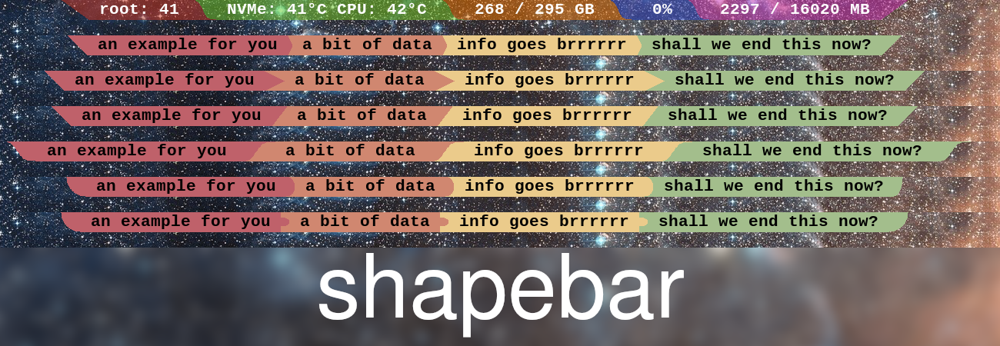

# Shapebar
Shapebar - Simple bar based on Lemonbar.

# SYNOPSIS
*lemonbar* [-h | -g *width*x*height*+*x*+*y* | -b | -d | -f *font* | -p | -n *name* | -u *pixel* | -B *color* | -F *color* | -U *color* | -o *offset* | -a *arc points*]

# DESCRIPTION
Shapebar is based on lemonboy/bar and krypt-n/bar which provides the
standard Lemonbar functionality along with Xft support. Shapebar adds
monitor cloning mode (-c), shape separators and removes clickable areas.

Shapebar is supposed to be a simple non interactive bar that only has
functionality to display info. I was annoyed by Polybar's many modules
that need to be compiled. This explodes the scope of the program. You
just pipe in the text from bash. I barely changed the input method from
the original Lemonbar. When I used Polybar I wanted triangles drawn in
the bar and did it very hacky by having a powerline font and using the
triangle char at exactly the right size. Shapebar adds shapes to draw in
the backgound. They serve as separators. This is how Shapebar derives
it's name.

Monitor cloning mode is introduced to have an easy method of having the
same bar everywhere for uniform sized monitors.
Clickable areas are removed because in my opinion bars should only
display info and using the mouse is a big no in most cases.

# OPTIONS
###### -h  
Display the help and exit.

###### -g *width*x*height*+*x*+*y*
Set the window geometry. If a parameter is omitted it's filled with
the default value. If the *y* parameter is specified along with the
-b switch then the position is relative to the bottom of the screen.

###### -b  
Dock the bar at the bottom of the screen.

###### -d  
Force docking without asking the window manager. This is needed if
the window manager isn't EWMH compliant.

###### -c  
Copy the the pixelmap of the headmonitor (the first one) to all
others and ignores %{S} blocks. Only Suitable for uniform sized
monitors. Light and fast. No error checking included. If you have
non uniform sized monitors it is undefined behaviour. If this does
not work in your situation, use %{S} blocks to get your string
across monitors.

###### -f *font*
Define the font to load into one of the five slots (the number of
slots is hardcoded and can be tweaked by changing the MAX_FONT_COUNT
parameter in the source code). This version supports fontconfig font
specifiers and anti-aliased fonts.

###### -p  
Make the bar permanent, don't exit after the standard input is
closed.

###### -n *name*
Set the WM_NAME atom value for the bar.

###### -u *pixel*
Sets the underline width in pixels. The default is 1.

###### -B *color*
Set the background color of the bar. *color* must be specified in
the hex format (#aarrggbb, #rrggbb, #rgb). If no compositor such as
compton or xcompmgr is running the alpha channel is silently
ignored.

###### -F *color*
Set the foreground color of the bar. Accepts the same color formats
as -B.

###### -o *offset*
Add a vertical offset to the text. *offset* must be a number and can
be negative. *-o -3* will push the text 3 pixels up.

###### -U *color*
Set the underline color of the bar. Accepts the same color formats
as -B.

###### -a *arc points*
set the number of points in the curved part of the arc, hemisphere
and sigmoid separator. Must be a non-negative integer.

# FORMATTING
lemonbar provides a screenrc-inspired formatting syntax to allow full
customization at runtime. Every formatting block is opened with "%{" and
closed by "}" and accepts the following commands, the parser tries its
best to handle malformed input. Use "%%" to get a literal percent sign
("%").

###### R   
Swap the current background and foreground colors.

###### l   
Aligns the following text to the left side of the screen.

###### c   
Aligns the following text to the center of the screen.

###### r   
Aligns the following text to the right side of the screen.

###### O*width*
Offset the current position by *width* pixels in the alignment
direction.

###### B*color*
Set the text background color. The parameter *color* can be *-* or a
color in one of the formats mentioned before. The special value *-*
resets the color to the default one.

###### F*color*
Set the text foreground color. The parameter *color* can be *-* or a
color in one of the formats mentioned before. The special value *-*
resets the color to the default one.

###### T*index*
Set the font used to draw the following text. The parameter *index*
can either be *-* or the 1-based index of the slot which contains
the desired font. If the parameter is *-* lemonbar resets to the
normal behavior (matching the first font that can be used for the
character). If the selected font can't be used to draw a character,
lemonbar will fall back to normal behavior for that character

###### U*color*
Set the text underline color. The parameter *color* can be *-* or a
color in one of the formats mentioned before. The special value *-*
resets the color to the default one.

###### S*dir*
Change the monitor the bar is rendered to. *dir* can be either

+/- Next/previous monitor.

f/l First/last monitor.

*0-9*
    Nth monitor.

###### Attribute modifiers

+*attribute*
    Set the attribute *attribute* for the following text.

-*attribute*
    Unset the attribute *attribute* for the following text.

!*attribute*
    Toggle the attribute *attribute* for the following text.

Where *attribute* is one of the following

o   Draw a line over the text.

u   Draw a line under the text.

###### Z*md*
Draw a separator. Use the format Z??. First char after the Z is the
mode, which selects the separator. Second char is the direction.
Possible modes are t, T, a, s, h. t Draws a triangle with an
horizontal and a vertical edge, T draws a triangle with a vertical
edge. a draws and arc and s draws a sigmoid. h draws a hemisphere.
Possible directions are < and > for left and right. For example Zt>
Draws a triangle separator orientated to the right. Separators
respect the width, height, foreground and background colour
formatting parameters.

###### W*width*
Sets the width parameter used for separators. The special value -
sets the width parameter to the bar height.

###### H*height*   
Sets the height parameter used for separators. The special value -
sets the height parameter to the bar height.

# ROADMAP
-C to clone bar over different sized monitors?
-Some more shapes?

# WWW
git repository <https://github.com/ocdy1001/shapebar>

# AUTHOR
2012-2017 (C) The Lemon Man

2020 (C) Cody Bloemhard

Xinerama support was kindly contributed by Stebalien

RandR support was kindly contributed by jvvv

